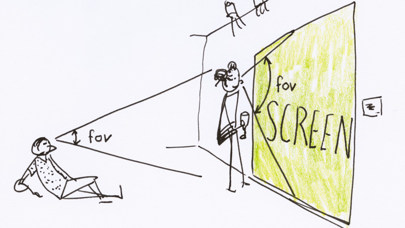

# Creating a basic 3D scene

This tutorial explains how to create a basic 3D scene with [three.js](http://threejs.org), a very powerful library for creating 3D with Javascript.

## Setup rendering context

The first thing we need to do is configure `#screen`, the DOM element that we use for display with an OpenGL context by using three.WebGLRenderer:

```lucidity
[ three.WebGLRenderer ]
```

This adds a canvas inside the `#screen` element and creates a WebGL renderer with the proper screen size. This block also creates a default [perspective camera](http://threejs.org/docs/#Reference/Cameras/PerspectiveCamera) with the following settings:

* 60° vertical field of view.
* aspect ratio synced to the screen dimension.
* frustum near plane set to 10 cm.
* frustum far plane set to 100 m.
* camera set back 2 meters from origin.

Note that we use ISO units like meters and seconds to help get a good and coherent understanding of what we are doing although these values don't have any meaning, at least in 3D graphics (they usually have one in physical simulations).

Let us explain why we chose these particular values.

### Vertical field of view

This sets the amount of things the imaginary viewer located at the camera would see. A large value means that the viewer sees far up and far down. For example, a 180° value would let the viewer see his or her feet and eyebrows.

This setting must be carefully set depending on how the 3D scene will be watched. Ideally, this angle should match the angle from the viewer to the screen. So for a viewer close to a screen (watching on a PC or in a gallery), the value should be greater then for a concert or gaming console situation.



We chose a value in between these two examples, something that looks natural in most situations. For gaming a common advice is to stay between 60°-75° to avoid making your viewers feel sick if they do not have their nose glued to the screen.

This [video](https://www.youtube.com/watch?v=p3AP8XLeRkI) can give you a feeling of the differences.

### Aspect ratio

This is simply a way to make sure the image is not distorted (circles look like circles, not ellipses). Typical values are 4/3, 16/9, etc and should match the viewers screen. One of the reasons you would want to not let this be in sync with the screen is when you know the aspect ratio of the final projection and you need to precisely see what will be seen on screen.

### Frustum near and far plane

This is how close and how far to the user we draw objects. Anything closer then the near plane is not drawn and so is anything further then the far plane. Think of it as "how close and how far the viewer can see". To transform the 3D scene into a perspective view, the graphics engine divides by the distance to the viewer `z`. If this value becomes too close to zero, bad things happen.

In order to have precise depth buffer calculations and avoid things like zig-zagging effects when planes "fight" for which is in front, try to keep the far and near plane as close as possible to one another. We use values of `0.1` and `100`, representing a depth field of `10 cm` to `100 m`.

PS: the "Frustum" is a strange word for the shape that defines what a user sees up, down, left, right, near and far. It's the pyramid you can draw with your arms embracing all you can see.

## Prepare for animation

If you intend to have things that change over time in your 3D scene and you are not simply creating a drawing, you can add `animation.Loop` to setup an animation loop that will update the graph once for every monitor refresh. This value is typically `1/60` seconds. We say that we draw at 60 fps (frames per seconds)..

You now have this processing graph, but nothing draws yet because there is no content to draw !

```lucidity
[ three.WebGLRenderer ]
[ animation.Loop ]
```

## Add a scene

A `three.Scene` is the root of a ... scene graph: a collection of objects to draw, lights, etc. In Lucidity, the scene is responsible for triggering the 3D rendering by calling `update` on its children and then calling the renderer's render function.

```lucidity
[ three.WebGLRenderer ]
[ animation.Loop ]
[ three.Scene ]
```

## Add a mesh

A `three.Mesh` is made of a geometry (a shape) and a material (how the shape should look like). By adding this block, it will register itself inside the scene and you will get something displayed on screen.

The default geometry for a mesh is a cube of size `1m`.

```lucidity
[ three.WebGLRenderer ]
[ animation.Loop ]
[ three.Scene ]
[ three.Mesh ]
```

## Animate the mesh

Let's rotate the cube ! For this, we change the Euler angle of the `y` and `x` axis of the cube depending on the elapsed time of the animation. By computing this change as a function of time we ensure that our cube stops on animation pause and will always have the same angle at the same place in our animation, independently of the frame rate or other rendering artifacts.

<aside class='notice'>
Try to use functions of state for dynamic properties instead of doing things like `value += 0.1`. This will make your animation more consistent across devices and will let you use pause, loops and other timing features.
</aside>

```lucidity
[ three.WebGLRenderer ]
[ animation.Loop ]
[ three.Scene    ]
[ three.Mesh     ]
[ three.Rotate.y ]
[ time.Now ]
```

To rotate the mesh, let's add a `three.Rotate.y` object to it with `time.Now` as child. The latter will feed the current elapsed time in seconds to its parent which uses this value to set the Euler angle for the `y` (up) axis in radians. Radians measure angles from `0` to `2*PI` but the convention for input/output blocks is to provide values in the range of `[0,1]` so the rotation is actually calculated like this:

```Javascript
object3d.rotation.y = input () * 2 * Math.PI
```

This will make the cube do a full rotation whenever the input goes from `0` to `1`, in this case in one second. We can stack another rotation on the `x` axis to make this nicer:

```lucidity
[ three.WebGLRenderer ]
[ animation.Loop ]
[ three.Scene    ]
[ three.Mesh     ]
[ three.Rotate.y ]
[ three.Rotate.x ]
[ time.Now ]
```

## A note about context

With this simple rotating cube, we do not know if we are moving the whole scene or just the cube. To be sure, let's add another mesh to the scene and move it slightly to the right (along the x axis) with `three.Position.x` and `value`:

```lucidity
[ three.WebGLRenderer                ]
[ animation.Loop                     ]
[ three.Scene                        ]
[ three.Mesh     ][ three.Mesh       ]
[ three.Rotate.y ][ three.Position.x ]
[ three.Rotate.x ][ value ]
[ time.Now ]
```

The `value` block simply returns `1` by default. As you can see, the `object3d` on which `three.Rotation.y` and `three.Position.x` act is not the same. This is because the `three.Mesh` blocks modify the context for their children by passing themselves as the new "thing on which to act in 3D".

Just for fun, you can now try dropping `three.Rotate.z` and another `time.Now` element on the third slot of `three.Scene` to see what happens.

```lucidity
[ three.WebGLRenderer                                  ]
[ animation.Loop                                       ]
[ three.Scene                                          ]
[ three.Mesh     ][ three.Mesh       ][ three.Rotate.z ]
[ three.Rotate.y ][ three.Position.x ][ time.Now ]
[ three.Rotate.x ][ value ]
[ time.Now ]
```

## A final note on conventions

The end of blocks names can give us a clue on what they do:

* Name ends with a single letter like `x`, `y`, `z` or `v` (for value): the block is expected to change the context through a value provided by a single child. Example: `three.Rotation.y`.

* Name ends with `ctx`: the block is a draft expecting the given context. Example: `three.Object3D.ctx`.

For example, if you wanted to rotate two axis based on some `beat` value that a parent passes through the context, you could use `three.Object3D.ctx` and write the update function by hand, taking care to properly fill the [expect](../meta.md#expect) field for this special `beat` thing.
